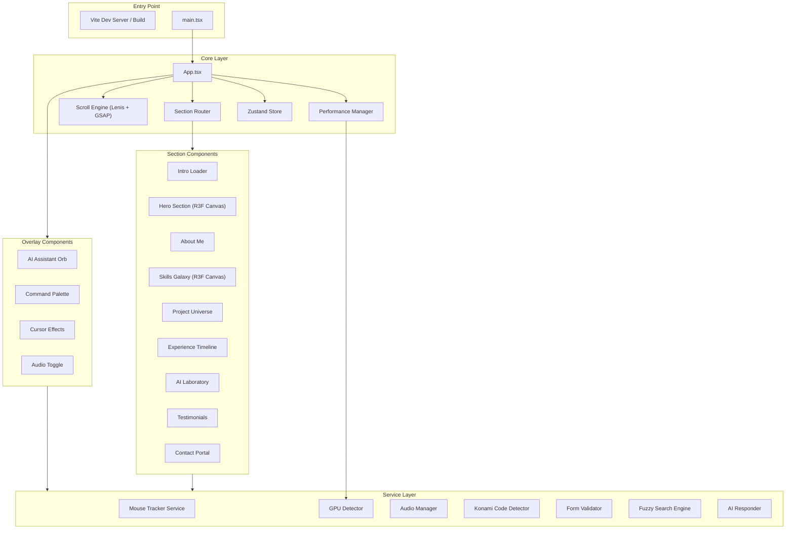
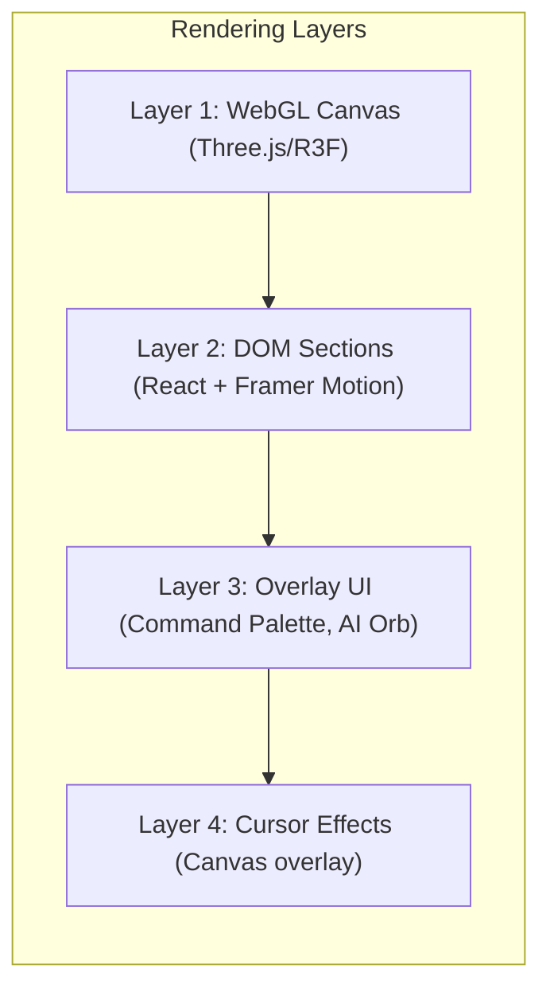
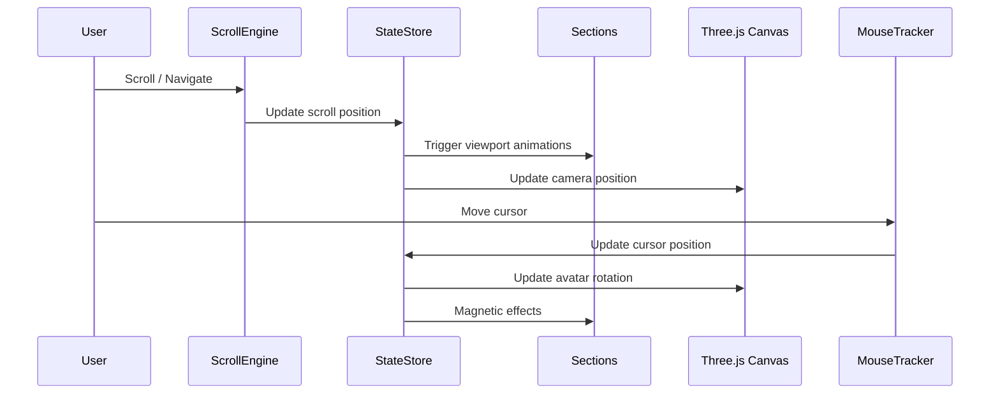

# Design Document: Futuristic Portfolio

## Overview

This design describes a world-class futuristic personal portfolio website for Umang Jaiswal. The application is a single-page React application built with Vite, featuring cinematic 3D environments (Three.js/React Three Fiber), advanced animations (Framer Motion, GSAP ScrollTrigger), smooth scrolling (Lenis), and a cohesive cyberpunk-inspired visual theme. The architecture prioritizes performance through lazy loading, GPU detection, and adaptive rendering while delivering an immersive, award-winning digital experience.

### Key Design Decisions

1. **Component-based architecture** with React + TypeScript for type safety and maintainability
2. **Layered rendering pipeline**: DOM layer (React/Framer Motion) + WebGL layer (Three.js/R3F) + Overlay layer (UI controls)
3. **Adaptive performance system**: GPU capability detection drives rendering quality decisions at startup
4. **Event-driven interaction model**: A centralized mouse/scroll tracker broadcasts position data to subscribers
5. **State management via Zustand**: Lightweight global state for theme mode, audio state, scroll position, and GPU tier

## Architecture

### High-Level Architecture



### Rendering Pipeline



### Data Flow



## Components and Interfaces

### Core Components

#### `App.tsx`
The root component that initializes all systems and renders the section layout.

```typescript
interface AppProps {}

// Responsibilities:
// - Initialize Lenis scroll engine
// - Initialize GPU detection and set performance tier
// - Render all sections in order
// - Render overlay components (AI Orb, Cursor, Audio Toggle)
// - Manage intro loader → main content transition
```

#### `IntroLoader`
```typescript
interface IntroLoaderProps {
  onComplete: () => void;
}

interface LoadingState {
  progress: number;        // 0-100
  phase: 'initializing' | 'loading' | 'complete' | 'error';
  startTime: number;
  errorMessage?: string;
}
```

#### `HeroSection`
```typescript
interface HeroSectionProps {
  isVisible: boolean;
}

interface AvatarState {
  rotationX: number;  // -20 to +20 degrees
  rotationY: number;  // -30 to +30 degrees
  floatOffset: number; // sine wave position
}
```

#### `SkillsGalaxy`
```typescript
interface SkillPlanet {
  id: string;
  name: string;
  proficiency: number;    // 0-100
  orbitRadius: number;
  orbitSpeed: number;     // 8-20 seconds per revolution
  color: string;
}

interface SkillsGalaxyProps {
  isVisible: boolean;
}
```

#### `ProjectUniverse`
```typescript
interface Project {
  id: string;
  title: string;
  description: string;
  techStack: string[];
  thumbnailUrl: string;
  videoUrl?: string;
  githubUrl: string;
  liveUrl?: string;
  screenshots: string[];
}

interface ProjectUniverseProps {
  projects: Project[];
  isVisible: boolean;
}
```

#### `ExperienceTimeline`
```typescript
interface TimelineMilestone {
  id: string;
  title: string;
  date: string;
  description: string;
  order: number;
}

interface TimelineState {
  illuminatedNodes: Set<string>;
  progressFill: number;  // 0-1 representing path fill
}
```

#### `AILaboratory`
```typescript
interface StatCounter {
  id: string;
  label: string;
  targetValue: number;
  currentValue: number;
  hasAnimated: boolean;
}

interface AILaboratoryProps {
  isVisible: boolean;
}
```

#### `ContactPortal`
```typescript
interface ContactFormData {
  name: string;       // max 100 chars
  email: string;      // max 254 chars
  message: string;    // max 1000 chars
}

interface ContactFormState {
  data: ContactFormData;
  errors: Record<keyof ContactFormData, string | null>;
  isSubmitting: boolean;
  submitResult: 'idle' | 'success' | 'error';
}
```

### Overlay Components

#### `AIAssistant`
```typescript
interface AIAssistantProps {}

interface ChatMessage {
  id: string;
  role: 'user' | 'assistant';
  content: string;
  timestamp: number;
}

interface AIAssistantState {
  isOpen: boolean;
  isProcessing: boolean;
  messages: ChatMessage[];
}

type AITopic = 'skills' | 'projects' | 'contact' | 'experience';
```

#### `CommandPalette`
```typescript
interface Command {
  id: string;
  label: string;
  action: () => void;
  keywords: string[];
  icon?: string;
}

interface CommandPaletteState {
  isOpen: boolean;
  query: string;
  filteredCommands: Command[];
  highlightedIndex: number;
}
```

#### `CursorEffects`
```typescript
interface Particle {
  id: number;
  x: number;
  y: number;
  vx: number;
  vy: number;
  life: number;     // 0-1, decreasing
  maxLife: number;
}

interface CursorState {
  position: { x: number; y: number };
  isTouch: boolean;
  particles: Particle[];
}
```

### Service Interfaces

#### `MouseTrackerService`
```typescript
interface MousePosition {
  x: number;
  y: number;
  normalizedX: number;  // -1 to 1
  normalizedY: number;  // -1 to 1
}

interface MouseTrackerService {
  subscribe(callback: (pos: MousePosition) => void): () => void;
  getPosition(): MousePosition;
  isTouch(): boolean;
}
```

#### `GPUDetectorService`
```typescript
type GPUTier = 'high' | 'low';

interface GPUDetectorService {
  detect(): GPUTier;
  getParticleCount(tier: GPUTier): number;
  shouldEnable3D(tier: GPUTier): boolean;
}
```

#### `FuzzySearchService`
```typescript
interface FuzzySearchService {
  search(query: string, commands: Command[]): Command[];
}
```

#### `FormValidatorService`
```typescript
interface ValidationResult {
  isValid: boolean;
  errors: Record<string, string | null>;
}

interface FormValidatorService {
  validate(data: ContactFormData): ValidationResult;
  validateEmail(email: string): boolean;
  validateRequired(value: string): boolean;
}
```

#### `KonamiDetectorService`
```typescript
interface KonamiDetectorService {
  handleKeyDown(key: string): boolean; // returns true if sequence completed
  reset(): void;
}
```

#### `AIResponderService`
```typescript
interface AIResponse {
  content: string;
  topic: AITopic | 'fallback';
}

interface AIResponderService {
  respond(question: string): AIResponse;
  getAvailableTopics(): AITopic[];
}
```

#### `AudioManagerService`
```typescript
interface AudioManagerService {
  initialize(): Promise<boolean>;
  setMuted(muted: boolean): void;
  isMuted(): boolean;
  isSupported(): boolean;
}
```

## Data Models

### Global State (Zustand Store)

```typescript
interface PortfolioStore {
  // Scroll state
  scrollPosition: number;
  currentSection: string;
  
  // Performance
  gpuTier: GPUTier;
  
  // Theme
  isCyberpunkMode: boolean;
  toggleCyberpunkMode: () => void;
  
  // Audio
  isMuted: boolean;
  isAudioSupported: boolean;
  setMuted: (muted: boolean) => void;
  
  // Cursor
  cursorPosition: MousePosition;
  isTouch: boolean;
  
  // Intro
  isLoading: boolean;
  loadingProgress: number;
  setLoadingComplete: () => void;
  
  // AI Assistant
  isAIOpen: boolean;
  toggleAI: () => void;
  
  // Command Palette
  isCommandPaletteOpen: boolean;
  toggleCommandPalette: () => void;
}
```

### Static Data Models

```typescript
// Project data (stored as static JSON/TS constants)
const PROJECTS: Project[] = [
  {
    id: 'ai-audio-safety',
    title: 'AI Audio Safety System',
    description: '...',
    techStack: ['Python', 'TensorFlow', 'Flask'],
    thumbnailUrl: '/assets/projects/ai-audio-safety.webp',
    videoUrl: '/assets/projects/ai-audio-safety.mp4',
    githubUrl: 'https://github.com/...',
    liveUrl: 'https://...',
    screenshots: []
  },
  // ... 5 more projects
];

// Skills data
const SKILLS: SkillPlanet[] = [
  { id: 'python', name: 'Python', proficiency: 90, orbitRadius: 3, orbitSpeed: 12, color: '#3776AB' },
  { id: 'react', name: 'React', proficiency: 85, orbitRadius: 4, orbitSpeed: 15, color: '#61DAFB' },
  { id: 'flask', name: 'Flask', proficiency: 80, orbitRadius: 5, orbitSpeed: 10, color: '#000000' },
  { id: 'postgresql', name: 'PostgreSQL', proficiency: 75, orbitRadius: 6, orbitSpeed: 18, color: '#336791' },
  { id: 'tensorflow', name: 'TensorFlow', proficiency: 85, orbitRadius: 7, orbitSpeed: 14, color: '#FF6F00' },
  { id: 'docker', name: 'Docker', proficiency: 70, orbitRadius: 8, orbitSpeed: 20, color: '#2496ED' },
  { id: 'aws', name: 'AWS', proficiency: 72, orbitRadius: 9, orbitSpeed: 16, color: '#FF9900' },
  { id: 'ml', name: 'Machine Learning', proficiency: 88, orbitRadius: 10, orbitSpeed: 8, color: '#8B5CF6' },
];

// Timeline milestones
const MILESTONES: TimelineMilestone[] = [
  { id: 'mba', title: 'MBA Graduate', date: '2023', description: '...', order: 1 },
  { id: 'entrepreneur', title: 'Entrepreneur', date: '2022', description: '...', order: 2 },
  { id: 'hackathons', title: 'Hackathons', date: '2023', description: '...', order: 3 },
  { id: 'ai-projects', title: 'AI Projects', date: '2024', description: '...', order: 4 },
  { id: 'leadership', title: 'Leadership Roles', date: '2024', description: '...', order: 5 },
];

// AI Assistant knowledge base
interface AIKnowledgeEntry {
  topic: AITopic;
  keywords: string[];
  responses: string[];
}

// Statistics
interface StatConfig {
  id: string;
  label: string;
  targetValue: number;
  suffix?: string;
}

const STATS: StatConfig[] = [
  { id: 'projects', label: 'Projects Completed', targetValue: 15, suffix: '+' },
  { id: 'technologies', label: 'Technologies Mastered', targetValue: 20, suffix: '+' },
  { id: 'github', label: 'GitHub Contributions', targetValue: 500, suffix: '+' },
  { id: 'hackathons', label: 'Hackathons Attended', targetValue: 8 },
];
```

### Theme Constants

```typescript
const THEME = {
  colors: {
    primary: '#00F5FF',       // Electric Blue
    secondary: '#8B5CF6',     // Neon Purple
    accent: {
      cyan: '#06B6D4',
      pink: '#EC4899',
      glassWhite: 'rgba(255, 255, 255, 0.1)',
    },
    background: '#050505',    // Deep Space Black
    text: {
      primary: '#FFFFFF',
      secondary: 'rgba(255, 255, 255, 0.7)',
      muted: 'rgba(255, 255, 255, 0.4)',
    },
    error: '#EF4444',
    success: '#10B981',
  },
  glassmorphism: {
    blur: '12px',
    borderOpacity: 0.15,
    gradientOpacity: 0.1,
  },
  typography: {
    fontFamily: 'Inter, sans-serif',
    weights: {
      heading: 700,
      subheading: 600,
      body: 400,
    },
  },
  animation: {
    scrollDuration: 1.2,
    scrollEasing: [0.25, 0.0, 0.35, 1.0],
  },
} as const;
```

## Correctness Properties

*A property is a characteristic or behavior that should hold true across all valid executions of a system — essentially, a formal statement about what the system should do. Properties serve as the bridge between human-readable specifications and machine-verifiable correctness guarantees.*

### Property 1: Loading progress is bounded and monotonic

*For any* sequence of asset loading events, the computed loading progress percentage SHALL always be in the range [0, 100], and each successive progress value SHALL be greater than or equal to the previous value (monotonically non-decreasing).

**Validates: Requirements 1.2**

### Property 2: Cursor-to-avatar rotation is clamped

*For any* cursor position within or outside the viewport, the computed avatar head rotation SHALL be within ±30 degrees horizontal and ±20 degrees vertical, regardless of cursor coordinates.

**Validates: Requirements 2.3**

### Property 3: Parallax layer offsets respect multipliers

*For any* scroll position value, the computed offset for each parallax layer SHALL equal the scroll position multiplied by that layer's speed multiplier (background: 0.3x, midground: 0.6x, foreground: 1.0x).

**Validates: Requirements 3.2, 3.5**

### Property 4: Card tilt angles are bounded

*For any* cursor position relative to a card's bounds, the computed 3D tilt angle SHALL be within ±15 degrees on both the X and Y axes.

**Validates: Requirements 4.3**

### Property 5: Timeline node illumination is threshold-based

*For any* set of timeline node positions and a scroll position, a node SHALL be illuminated if and only if it has scrolled past 75% from the top of the viewport, and the progress fill SHALL equal the ratio of illuminated nodes to total nodes.

**Validates: Requirements 7.2**

### Property 6: Counter easing produces bounded monotonic values

*For any* target value ≥ 0 and elapsed time between 0 and the animation duration (2 seconds), the counter's current value SHALL be in the range [0, target], monotonically non-decreasing with time, and SHALL equal the target value when elapsed time equals the duration.

**Validates: Requirements 8.3**

### Property 7: Form validation correctly classifies inputs

*For any* contact form data, the validation function SHALL: mark name as invalid if empty or exceeding 100 characters, mark email as invalid if empty, exceeding 254 characters, or not matching a valid email format, mark message as invalid if empty or exceeding 1000 characters, and return isValid=true only when all fields pass validation.

**Validates: Requirements 10.1, 10.5, 10.6**

### Property 8: AI responder routes questions to correct topics

*For any* question string containing keywords associated with a known topic (skills, projects, contact, experience), the AI responder SHALL return a response classified under that topic. *For any* question string containing no recognized topic keywords, the AI responder SHALL return a fallback response.

**Validates: Requirements 11.3, 11.5**

### Property 9: Fuzzy search returns valid subsets

*For any* query string and list of commands, the fuzzy search result SHALL be a subset of the input commands, SHALL contain only commands whose label or keywords fuzzy-match the query, and SHALL be ordered by match relevance score (descending).

**Validates: Requirements 12.3**

### Property 10: Magnetic pull is distance-gated and magnitude-bounded

*For any* cursor position and interactive element position, the computed magnetic translation SHALL be zero when the distance exceeds 50px, and SHALL have a magnitude no greater than 8px when the distance is 50px or less.

**Validates: Requirements 13.2**

### Property 11: Konami code detection is sequence-exact

*For any* sequence of key presses, the Konami detector SHALL return true only when the last 10 keys exactly match the Konami sequence (Up, Up, Down, Down, Left, Right, Left, Right, B, A). Any incorrect key in the sequence SHALL reset the detection state.

**Validates: Requirements 14.1**

## Error Handling

### Loading Errors (Requirement 1.7)
- If asset loading fails or exceeds 10 seconds, display an error message with a retry button
- Retry resets the loader to initial state and re-attempts all asset loading
- Network errors during loading are caught and surfaced to the user

### Form Submission Errors (Requirements 10.6, 10.7, 10.8)
- Client-side validation errors are displayed inline adjacent to each invalid field
- Network errors during submission preserve user data and show a generic error message
- A 10-second timeout triggers a timeout error message
- The submit button is disabled during submission to prevent duplicate requests

### Audio Context Errors (Requirement 17.4)
- If Web Audio API is unsupported or initialization fails, the mute/unmute toggle is hidden
- The application continues operating without audio functionality
- No error is surfaced to the user — graceful degradation

### GPU Detection Errors (Requirement 15.7)
- If GPU capability detection fails, default to reduced-performance mode
- Reduced mode: lower particle counts, disabled background 3D, decorative effects off
- Ensures minimum 30 FPS on all devices

### AI Assistant Errors
- If the AI responder cannot classify a question, return the fallback response listing available topics
- Chat interface remains functional regardless of response errors

### 3D Rendering Errors
- If Three.js canvas fails to initialize, fall back to a static gradient background
- Hero section degrades to 2D text-only layout
- Skills Galaxy degrades to a flat grid layout

## Testing Strategy

### Unit Tests (Example-Based)
- **Component rendering**: Verify each section renders correct content and structure
- **Animation triggers**: Verify animations start at correct scroll thresholds
- **Interaction handlers**: Verify click, hover, and keyboard events produce correct state changes
- **Edge cases**: Touch device fallbacks, missing project data, audio unsupported
- **Accessibility**: Focus trap in modals, keyboard navigation in command palette, tap targets on mobile

### Property-Based Tests (fast-check)
- **Library**: [fast-check](https://github.com/dubzzz/fast-check) for TypeScript property-based testing
- **Configuration**: Minimum 100 iterations per property test
- **Tag format**: `Feature: futuristic-portfolio, Property {number}: {property_text}`
- **Coverage**: All 11 correctness properties implemented as property-based tests
- Properties test the pure service-layer functions (validation, search, calculations, detection)

### Integration Tests
- **Scroll engine**: Verify Lenis + GSAP integration produces smooth transitions
- **Audio context**: Verify Web Audio API initialization on user interaction
- **Form submission**: Verify end-to-end form submit with mock backend
- **localStorage**: Verify audio preference persistence across page loads

### Performance Tests
- **Lighthouse audit**: Verify score ≥ 90 on desktop
- **Bundle size**: Verify initial bundle ≤ 200KB gzipped
- **FPS monitoring**: Verify 60 FPS on high-tier GPU, 30 FPS on low-tier
- **Lazy loading**: Verify assets > 50KB are not in initial bundle

### Visual Regression Tests
- **Theme consistency**: Snapshot tests for glassmorphism panels, color usage
- **Responsive layouts**: Snapshots at 320px, 768px, 1024px, 1440px viewports
- **Cyberpunk mode**: Snapshot comparison of default vs cyberpunk theme

